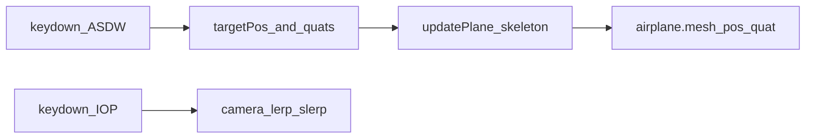

# 완료 재점검 (요약)

| 항목 | 상태 |
|------|------|
| 스켈레톤 translation (targetPos, 0.1 보간, y=100 시작) | 완료 |
| 스켈레톤 rotation (start/mid/end/target + SLERP, `blendFromMotion`·`dtStep` 역할 분리) | **완료** (`assignment1` `game.js` updatePlane (B)) |
| 충돌 등 mesh 월드 정합 (`getPlaneWorldPosition`) | 완료 |
| **Step3 카메라 I/O/P/K·legacy 토글** (목표 pose lerp/slerp·스냅, Space) | **완료** (`game.js` Lab1 카메라 블록) |
| 제출용 lab1_[이름].html/js·zip | **pending** (교안 템플릿 수령 후) |
| Demo 모드 | **pending** (본 문서 §8) |

# 과제1 코드 구현 계획 (스켈레톤 우선 / 기존 코드 최소 변경)

## 실행 방침 (Notion과 동기화)

- 세부 수정 항목·순서는 **[CompGraph2026 → 4. Skeleton 맞춤 수정 체크리스트 (game.js)](https://www.notion.so/356e83691933811a9fe8d9a41c7667fd)** 와 이 문서를 동일하게 본다.
- 코드에는 `// --- Lab1 skeleton: 전역 / keydown / updatePlane (과제 PDF·Notion) ---` 같이 **구간 주석**을 두어, Fork에서 바뀐 부분과 과제 블록을 구분한다.

## 전제와 해석

- [과제 설명](https://www.notion.so/356e836919338083a83ddff4354851ef) 스켈레톤은 **`targetPos` + `startQuat` / `midQuat` / `endQuat` / `targetQuat` + `updatePlane()`** 안의 `t`·`slerpT` 분기(예시의 `slerpT` 포함) **구조와 규격을 1차 그대로** 두는 것이 목표다.
- “더 나은 if/else”는 **동작 확인 후 별도 브랜치**에서만 다룬다.
- “기존 코드 최대한 안 건드리기”는 **전면 리팩터 금지**. 스켈레톤이 **`airplane.mesh.position`** 을 쓰므로 [`src/game.js`](c:\Users\AIproject2025\source\2026CompGraf\TheAviator\src\game.js) 의 **충돌/거리 계산(`airplaneRig.position`)** 은 **`getWorldPosition` 등으로 소수 줄 정합**하는 수준은 불가피하다.

## 스켈레톤 반영 후 “어떻게 도는지” 설명 가능 여부

**가능하다.** 위 방식으로 두면 다음이 한 세트로 정리되어 보고서·면접·구술에서 말로 연결하기 쉽다.

1. **이벤트:** ASDW `keydown` 한 번 → 그 시점 `airplane.mesh.position` 기준으로 `targetPos`(+30 규칙), `startQuat` 저장, `targetQuat` 축각 설정.
2. **매 프레임:** `updatePlane()` 가 스켈레톤대로 `targetY/Z`로 위치 보간, `t`와 분기로 `airplane.mesh.quaternion`을 slerp, 필요 시 `midQuat` 동기화·`slerpT` 증가.
3. **Fork 접착:** 릴과 메시가 갈라져 있으면, 동기화 한 줄 또는 충돌 판정만 월드 좌표로 통일—“스켈레톤은 mesh 로컬, 게임 판정은 월드” 한 문장으로 설명.
4. **근거:** 제출 `game.js`에서 주석 블록 + 과제 문서 절 번호(또는 스크린샷)를 짝지으면 “교수님 skeleton을 이 구간에 구현했다”가 코드상으로도 읽힌다.

## 1. 계층과 좌표: 스켈레톤과 맞추기

현재: `airplaneRig`(월드 이동) + 자식 `airplane.mesh`(오일러로 기울기).      

스켈레톤: `airplane.mesh.position.y/z` 보간, `airplane.mesh.quaternion` slerp.

**권장 정렬 (구현 시 선택지를 하나로 고정):**

- 초기에 **월드 높이 100**을 스켈레톤대로 맞추려면 예: **`airplaneRig.position`을 (0,0,0)에 두고 `airplane.mesh.position`을 (0,100,0)** 으로 두거나, 반대로 **릴 y=100·메시 y=0** (지금과 동일)인 채 스켈레톤의 `airplane.mesh.position`만 **오프셋**으로 쓰는 방식 중 하나를 택한다.
- 1차 목표는 “스켈레톤 줄을 그대로 읽을 수 있게” 하는 것이므로, **과제 예시에 나온 `airplane.mesh.position.y += …` / `targetY` 줄은 파일에 그대로 두고**, 필요 시 그 직전/직후에 **릴과의 동기화 한 줄**만 주석으로 “프로젝트 호환”이라고 표시한다.
- **충돌/코인/적**: [`airplaneRig.position`을 쓰는 부분](c:\Users\AIproject2025\source\2026CompGraf\TheAviator\src\game.js) (대략 L745, L885 근처)을 **`airplane.mesh.getWorldPosition(...)`** (또는 동일 결과의 헬퍼)로 바꿔, 메시/릴 분리 후에도 거리 판정이 유지되게 한다.

## 2. 스켈레톤 “복제” 삽입 위치

- **전역**: `targetPos`(Vector3), `startQuat`, `midQuat`, `endQuat`, `targetQuat`, `slerpT` 및 과제에서 요구하는 초기값 준비.
- **keydown**: 과제대로 **당시 기준**으로 `targetPos`를 **30.0** 스텝 규칙에 맞게 설정; `startQuat.copy(airplane.mesh.quaternion)`; 입력 방향에 맞게 `targetQuat.setFromAxisAngle(...)`.
- **`updatePlane()`**: Notion에 있는 예시 블록을 **주석/공백 포함 가능한 한 동일하게** 유지한 채 [`updatePlane`](c:\Users\AIproject2025\source\2026CompGraf\TheAviator\src\game.js) 내부에 통합.
  - Three.js r152+ API: `THREE.Quaternion.slerpQuaternions( qa, qb, t, dest )` 또는 `dest.copy(qa).slerp(qb, t)` — **스켈레톤 함수명 `slerpQuaternions`가 쓰이면** 그 시그니처에 맞춰 호출 (문서 확인 후 고정).
  - **`airplane.propeller.rotation.x += 0.2`** 는 현재 루프(`loop`)에도 propeller 회전이 있으므로, **중복만큼만 조정**해 시각적으로 두 배로 돌지 않게 하는 최소 수정.

## 3. 기존 WASD 처리와의 관계 (최소 충돌)

- 지금은 **hold-to-move** (`keysDown` + 매 프레임 이동) 입니다. 과제는 **keydown 한 번에 target 갱신** 쪽입니다.
- 스켈레톤 우선이라면: **과제용 로직을 우선 적용**하고, 기존 `if (keysDown.has ...)` 기반의 즉시 이동/오일러 기울기는 **같은 프레임에 실행되지 않게** `updatePlane()` 안에서 분기로 막는 편이 안전합니다 (변경 범위: `updatePlane` 한 함수 내부 위주).

## 4. 카메라 (계획 문서 [3. 카메라…](https://www.notion.so/3-356e83691933813285a0daf30dd04555) 반영)

- **키**: 사용자 계획 **i = side(기본), o = FPS, p = top** + 과제 명시 **O/P**와의 정합: 과제 채점용으로 **최소 O·P는 반드시 동작**하게 매핑 (예: `KeyO`/`KeyP`는 유지, `KeyI`는 side 추가).
- **부드러운 전환**: 모드마다 저장해 둔 **목표 월드 position + 목표 quaternion** 으로,
  - `camera.position` 은 잔차 비율 lerp (과제 비행기 위치 보간과 동일한 “논리”),
  - `camera.quaternion` 은 slerp.
- 기존 **Space 순환**(third/first/orbit), `enterFirstPerson` / `applyThirdPersonCamera` / `OrbitControls` 는 **당장 끊지 말고**, 과제 모드가 켜진 뒤에는 “고정 카메라 모드”와 충돌 나지 않게 **`handleKeyDown`에서만** 최소 분기 (예: 과제용 모드일 때 Space 무시 또는 별도 설계 — 구현 단계에서 한 가지만 택).

## 5. 제출 규칙 (저장소에 템플릿 없음)

현재 [`index.html`](c:\Users\AIproject2025\source\2026CompGraf\TheAviator\index.html) 은 `/src/main.js` 모듈 진입이다. 교안 **template html**은 레포에 없으므로:

- 강의에서 받은 HTML 골격에 맞춰 **`lab1_[이름].html`** 을 두고 `script` 가 **`lab1_[이름].js`** 를 로드하게 맞춘다.
- Vite 사용 시: **별도 엔트리**(예: `src/lab1-entry.js` → `import './game.js'` 또는 최종 묶음) + `vite build` 로 단일 번들을 **`lab1_[이름].js`** 로 rename 해 제출, 또는 교수가 요구하는 **비번들 단일 파일** 구조면 그에 맞춰 한 번 더 정리한다.

zip 명 `[학번][이름]_과제1.zip` 은 사용자 측 패키징.

## 6. Git 브랜치

- **`assignment1-baseline`** (또는 동일 목적): 스켈레톤 그대로 + 동작 + 카메라 기본 전환.
- **`assignment1-polish`** (나중): if/else 및 전환·은행각 개선만.

## 7. 완료 기준 (0점 방지 체크)

- `npm run dev` 로 로딩·에러 없음.
- ASDW: **keydown 기반 targetPos** + 화면에서 목표로 스무스 이동.
- 쿼터니언: **slerp가 실제로 호출**되고 기울기가 순간 점프만 하지 않음.
- **O/P** 카메라 전환 + (계획대로) **I side** + 전환 시 끊김 없음.
- 리포트/zip/js 이름은 사용자 제출 단계 (코드와 별개).

## 8. Demo 모드 (과제 채점과 별도 — 시연·촬영·플레이 테스트용)

- **UI:** 화면 **오른쪽 위**에 컨트롤(토글 또는 “Demo” 버튼 등). **게임을 시작한 뒤** Demo를 켤 수 있게 하거나, 버튼이 곧 시작 트리거라면 “시작 → Demo on” 순서를 명확히 함.
- **Demo on일 때:**
  - **점수/충돌 관련 오브젝트**가 보이지 않게 처리: 코인·적 메시 숨김(`visible=false`) 또는 홀더 제거, 스폰/충돌 검사·에너지 감소 등 **관련 게임 로직은 실행하지 않음**(숨겨만 두고 충돌이 나면 안 됨).
  - **바다:** 적용 중인 **lava 셰이더(용암 룩) 끔** — 예: Sea를 기본 `MeshPhong` 등 백업 재질로 바꾸거나, `createSeaLavaShaderMaterial` 경로를 우회하는 플래그.
- **과제 제출물과의 관계:** 교수님이 “수정한 js/html만” 요구할 때 **Demo 모드 코드도 같이 포함**해도 되는지는 수업 확인 권장. 기본은 **제출 빌드에서 Demo UI를 숨기거나** `demoMode=false` 고정으로 둘 수 있음.

## 추후 추가구현 (사용자가 직접 말하기 전에는 하지 않음)

- **에이전트 규칙:** 아래 한 줄 항목들을 **사용자가 명시적으로 요청하기 전에는 구현·수정하지 않는다.**
- `targetPos`(또는 최종 위치)에 원/링 등으로 목표를 보이게 하는 시각화.
- 과제 영상처럼 **heuristic 회전**과 **slerp 회전**을 비교할 수 있게 하는 토글(또는 별도 모드).

