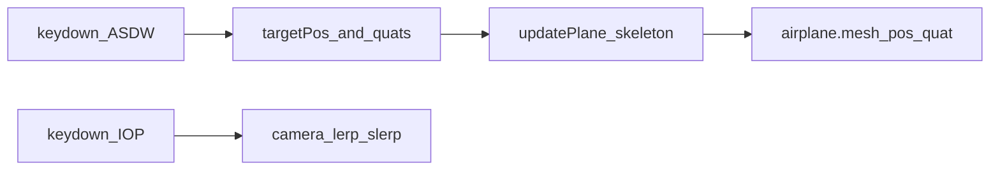

# 과제1 코드 구현 계획 (스켈레톤 무수정 붙여넣기 → 과제 요구만 완성 + Demo mode 정식 포함)

## 작업 순서 (고정)

1. **스켈레톤 통째로 붙이기** — 과제 문서의 변수 선언·`updatePlane()` 예시( `t` / `slerpT` 분기 포함)·주석·공백까지 **의도적으로 수정하지 않고** 삽입한다.
2. **과제가 요구하는 부분만 완성** — 예시 안의 `// update … slerpQuaternions` 등 **채워야 하는 로직**, keydown에서 `targetPos`·`startQuat`·`targetQuat` 설정 등 **명시된 요구만** 수정한다.
3. **스켈레톤 밖 최소 연결** — 엔진이 돌아가게 `loop`에서 호출, `createPlane`에서 `airplane.mesh.position.y = 100` 등 **과제 전제와 맞는 초기값**, 필요 시 충돌/코인 거리 계산은 **스켈레톤을 건드리지 않고** 주변 코드만 조정한다.
4. **Demo mode (정식)** — [`index.html`](c:\Users\AIproject2025\source\2026CompGraf\TheAviator\index.html) 오른쪽 위 토글 + [`game.js`](c:\Users\AIproject2025\source\2026CompGraf\TheAviator\src\game.js)에서 코인·적 **스폰 차단**. 비행·카메라 비교·촬영을 위해 **이 과정에 반드시 포함**한다 (아래 § Demo mode 참고).

이 순서는 **수업 중 The Aviator를 각자 AI로 최신화한 뒤, 무엇이 바뀌었는지 전부 파악하기 어렵고**, **제출은 수정한 js와 html만** 요구받는 상황에서, **과제 스켈레톤을 채점·보고서 대응의 기준 블록으로 남기기 위함**이다.

## 전제와 해석

- [과제 설명](https://www.notion.so/356e836919338083a83ddff4354851ef)의 `targetPos`, `startQuat` / `midQuat` / `endQuat` / `targetQuat`, `updatePlane()` 안의 `t`·`slerpT` 분기(교안의 `slerpT` 표기 포함)는 **붙여 넣은 뒤에는 골격·규격을 바꾸지 않는다.**
- “더 나은 if/else”는 **동작 확인 후 별도 브랜치**에서만 다룬다.
- **Demo mode**(코인·적 미스폰 UI)는 과제 스켈레톤과 별개이지만, **본 계획의 정식 단계**로 포함해 구현한다.
- `airplaneRig`·충돌·기존 WASD 등 **베이스 게임 코드와의 충돌**은 **스켈레톤 텍스트가 아니라 그 밖**에서 최소한으로 처리한다.

## 1. 계층과 좌표 (스켈레톤 vs 베이스)

현재 베이스: `airplaneRig`(월드 이동) + 자식 `airplane.mesh` 등.

과제 스켈레톤: `airplane.mesh.position.y/z` 보간, `airplane.mesh.quaternion` slerp.

- 스켈레톤에 적힌 `airplane.mesh.position.y += …` 같은 줄은 **그대로 둔다.**
- 월드 좌표가 어긋나 충돌이 깨지면 **`getWorldPosition` 보정 등은 스켈레톤 밖**에서만 논의·수정한다.

## 2. 스켈레톤이 들어갈 위치 (붙여넣기 단계에서 할 일)

- **전역**: 과제에 나온 `targetPos`, `startQuat`, `midQuat`, `endQuat`, `targetQuat`, `slerpT` 등을 **문서와 동일하게** 둔다.
- **keydown 핸들러** (또는 과제가 정한 이벤트 자리): 문서대로 `targetPos` **30.0** 스텝, `startQuat.copy(airplane.mesh.quaternion)`, `targetQuat.setFromAxisAngle(...)` — 이 부분은 **과제 요구이므로 “완성 단계”에서 채운다.** 붙여넣기 단계에서는 스켈레톤에 이미 템플릿이 있으면 그대로 두고, 없으면 교안 위치에만 추가한다.
- **`updatePlane()`**: Notion 예시 블록을 **가능한 한 동일하게** [`src/game.js`](c:\Users\AIproject2025\source\2026CompGraf\TheAviator\src\game.js)에 둔다.
  - Three.js API: `slerpQuaternions` / `.slerp` 등은 **완성 단계**에서 과제가 요구하는 호출만 채운다.
  - `airplane.propeller.rotation.x += 0.2`는 스켈레톤에 있다면 **원문 유지**를 우선하고, `loop`와 중복되면 **스켈레톤이 아닌 쪽**(예: `loop`)만 최소 조정한다.

## 3. 기존 WASD 처리와의 관계 (베이스 코드, 스켈레톤 밖)

- 베이스의 **hold-to-move**와 과제 **keydown·target** 방식이 겹치면, **스켈레톤 if 분기를 바꾸지 않도록** 하고, 가능하면 **베이스 측 입력 처리**만 꺼거나 분기해 같은 프레임에 두 세계가 섞이지 않게 한다.

## 4. 카메라 (계획 문서 [3. 카메라…](https://www.notion.so/3-356e83691933813285a0daf30dd04555) 반영)

- **키**: 사용자 계획 i = side(기본), o = FPS, p = top + 과제 명시 O/P — 채점용으로 최소 O·P는 반드시 동작 (예: `KeyO` / `KeyP`, `KeyI`는 side).
- **부드러운 전환**: 모드마다 목표 월드 position + 목표 quaternion — `camera.position`은 잔차 비율 lerp, `camera.quaternion`은 slerp.
- 기존 Space 순환·`enterFirstPerson` / `applyThirdPersonCamera` / `OrbitControls` 는 당장 끊지 말고, `handleKeyDown`에서만 최소 분기 (과제 모드와 Space 충돌 시 한 가지 방식만 택).

## 5. 제출 규칙 (저장소에 템플릿 없음)

현재 [`index.html`](c:\Users\AIproject2025\source\2026CompGraf\TheAviator\index.html) 은 `/src/main.js` 모듈 진입. 교안 template html은 레포에 없으므로:

- 강의 HTML에 맞춰 `lab1_[이름].html` 과 `lab1_[이름].js` 로드 경로를 맞춘다.
- Vite: 별도 엔트리 + `vite build` 후 번들을 `lab1_[이름].js` 로 두거나, 교수 요구에 맞는 단일 파일 구조로 정리.

zip 명 `[학번][이름]_과제1.zip` 은 사용자 측 패키징.

## Demo mode (정식 과정 — 비행·카메라 비교용)

코인(점수)·적(장애물)이 거리마다 계속 스폰되면 과제 동작을 화면으로 비교하기 어렵다. [수정 `game.js` + `index.html`만 쓰는 제출 형태](https://github.com/insung52/computer_graphics_2026/tree/main/%EC%98%88%EB%B9%84/1_threejsupdate)에서도 마찬가지이므로, **Demo mode는 선택이 아니라 본 구현 계획의 필수 단계**다. 과제 스켈레톤 블록은 건드리지 않고, **스켈레톤 밖**에서만 다음을 구현한다.

### 무엇을 건드리나 (필수)

| 파일 | 할 일 |
|------|--------|
| [`index.html`](c:\Users\AIproject2025\source\2026CompGraf\TheAviator\index.html) | 오른쪽 위에 고정 버튼(또는 라벨+토글) 추가. 예: `<button type="button" id="demoModeToggle">Demo mode</button>`. 위치는 `position: fixed; top: …; right: …; z-index` 를 `<style>` 한 덩어리 또는 기존 [`css/game.css`](c:\Users\AIproject2025\source\2026CompGraf\TheAviator\css\game.css)에 클래스 추가. **제출을 html·js만 한다면** 스타일은 HTML 안에 두어도 됨. |
| [`src/game.js`](c:\Users\AIproject2025\source\2026CompGraf\TheAviator\src\game.js) | (1) 플래그 `let demoMode = false` (또는 `game` 객체 프로퍼티). (2) `init()` 끝에서 `#demoModeToggle` 클릭 시 `demoMode = !demoMode` 및 버튼 문구·클래스 갱신. (3) **`loop()` 안 `game.status === 'playing'` 블록**에서 `coinsHolder.spawnCoins()` 호출 직전 조건에 `&& !demoMode` (동전 스폰 구간은 대략 `distance`·`coinLastSpawn` 체크 부분, 현재 L964–970 근처). (4) 같은 방식으로 `ennemiesHolder.spawnEnnemies()` 구간(L980–986 근처)에 `&& !demoMode`. |

### 최소 변경의 의미

- **스폰만 막으면** 이미 필드에 나와 있는 코인·적은 그대로 움직이며 충돌할 수 있다. **처음부터 Demo mode 켜고** 비교하면 깨끗하다.
- 한 단계 더 가려면: `demoMode`일 때 `coinsHolder.rotateCoins()` / `ennemiesHolder.rotateEnnemies()` 호출을 건너뛰거나, `coinsHolder.mesh.visible` / `ennemiesHolder.mesh.visible` 을 `false`로 두어 화면·충돌을 같이 끈다(이때는 L1026–1027 근처도 조건부).

### 보조 동작 (권장, 스켈레톤 밖)

- 플레이 중 Demo mode를 켜면 **이미 스폰된** 코인·적이 남을 수 있으므로, 토글 시 홀더에서 메시를 빼 풀에 돌려보내는 **`clearCollectiblesForDemo()`** 헬퍼를 두면 촬영·비교가 깨끗하다.
- `init()`에서 `getElementById('demoModeToggle')`이 **null**이면 리스너를 달지 않게 하면, HTML만 달라진 빌드도 안전하다.
- **`createCoins()` / `createEnnemies()`** 는 풀·홀더만 만들 뿐 즉시 필드에 깔지 않으므로, “안 나오게”의 핵심은 **`spawnCoins` / `spawnEnnemies`를 호출하지 않는 것**이다.
- Demo여도 **`updateDistance`·`updateEnergy`·레벨**은 기본적으로 돌아간다. 에너지까지 멈추려면 **별도 플래그**로 `updateEnergy` 등만 스켈레톤 밖에서 가드.

### 과제 제출과의 관계

- 교수님 지시가 **UI 추가 금지**가 아니면, Demo 버튼·로직은 **제출물에 포함하는 것이 이 계획의 기본**이다. **금지**이면 교안에 맞춰 zip 전에 제거하거나 대체 수단을 둔다.

### 에이전트 규칙

- **Demo mode는 정식 단계까지 코드에 반영한다.** (과제 스켈레톤 본문은 여전히 임의로 바꾸지 않는다.)

## 6. Git 브랜치

- `assignment1-baseline` (또는 동일 목적): 스켈레톤 보존 + 동작 + 카메라 전환 + **Demo mode**.
- `assignment1-polish` (나중): if/else 및 전환·은행각 개선만.

## 7. 완료 기준 (0점 방지 체크)

- `npm run dev` 로 로딩·에러 없음.
- ASDW: **keydown 기반 targetPos** + 화면에서 목표로 스무스 이동.
- 쿼터니언: **slerp가 실제로 호출**되고 기울기가 순간 점프만 하지 않음.
- **O/P** 카메라 전환 + (계획대로) **I side** + 전환 시 끊김 없음.
- **Demo mode:** 화면 **오른쪽 위**에서 토글 가능, 켠 뒤 **새 코인·적이 스폰되지 않음** (권장: 기존해도 정리).
- 리포트/zip/js 이름은 사용자 제출 단계 (코드와 별개).

## 추후 추가구현 (사용자가 직접 말하기 전에는 하지 않음)

- **에이전트 규칙:** 아래 한 줄 항목들을 **사용자가 명시적으로 요청하기 전에는 구현·수정하지 않는다.**
- `targetPos`(또는 최종 위치)에 원/링 등으로 목표를 보이게 하는 시각화.
- 과제 영상처럼 **heuristic 회전**과 **slerp 회전**을 비교할 수 있게 하는 토글(또는 별도 모드).

