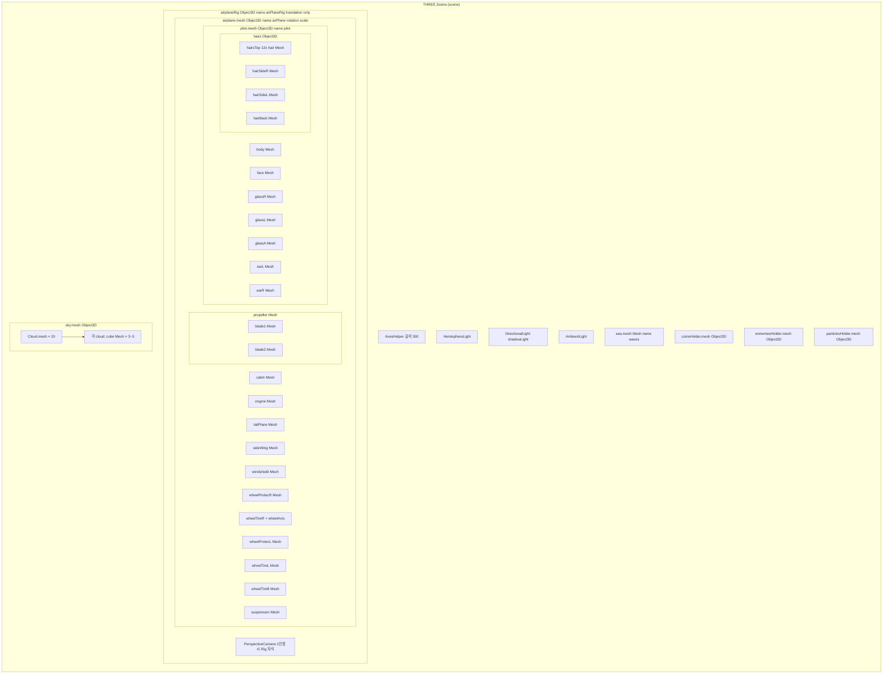
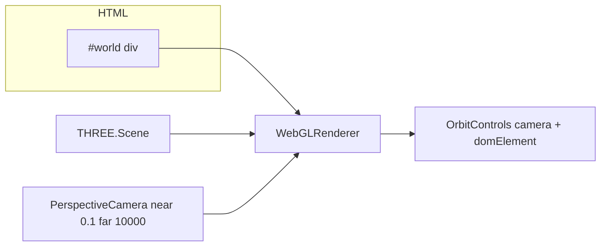

# 메인 게임 Scene 트리 (`src/game.js`)

Three.js에서 **`scene.add(...)`로 붙는 객체**와, **씬에 들어가지 않지만 렌더링에 쓰이는 객체**(카메라, 렌더러, OrbitControls)를 구분해 정리했습니다.

---

## 1. 씬 그래프 (Scene 자식)

`createScene` → `createLights` → `createPlane` / `createSea` / `createSky` / `createCoins` / `createEnnemies` / `createParticles` 순으로 구성됩니다.

동적 추가:

- **coinsHolder.mesh** 아래: 스폰 시 `coin.mesh` (TetrahedronGeometry)
- **ennemiesHolder.mesh** 아래: 스폰 시 `ennemy.mesh` (TetrahedronGeometry)
- **particlesHolder.mesh** 아래: 이펙트 시 `particle.mesh` (TetrahedronGeometry)

**바다 메시 (`Sea`)**: `CylinderGeometry`에 `rotateX(-π/2)`를 적용한 뒤 `mergeVertices(geom, SEA_MERGE_VERTICES_TOLERANCE)`로 버텍스를 병합합니다. 허용 오차는 `src/game.js`의 `SEA_MERGE_VERTICES_TOLERANCE`(기본 `2.1`)이며, 기본 `mergeVertices`의 `1e-4`보다 넓게 잡아 변환 후 생기는 이음에서 메시가 끊겨 보이는 현상을 완화합니다.

---

## 2. 씬 밖 · 렌더 파이프라인

카메라는 **`scene`의 자식이 아닙니다.** `renderer.render(scene, camera)`로 씬과 함께 사용됩니다.

- **OrbitControls**: `viewMode === 'orbit'`일 때 `enabled`, `target`이 `airplaneRig.position`을 부드럽게 추적합니다.
- **카메라**: 3인칭·Orbit일 때는 씬에 붙지 않은 월드 카메라. 1인칭일 때만 `airplaneRig`의 자식(메시와 형제).
- **안개**: 현재 `scene.fog = null` (비활성). 자세한 내용은 `FOG_DISABLED.md` 참고.

---

## 3. 다이어그램 파일

| 파일 | 용도 |
|------|------|
| 이 문서 (`SCENE_TREE_DIAGRAM.md`) | Mermaid 다이어그램 (GitHub, VS Code 등에서 미리보기) |
| `scene-tree.dot` | Graphviz (`dot -Tpng scene-tree.dot -o scene-tree.png`) |
| `COLOR_MANAGEMENT_LEGACY.md` | 렌더 색 공간·`ColorManagement` 정책 (룩 정렬 vs 추후 검토) |

